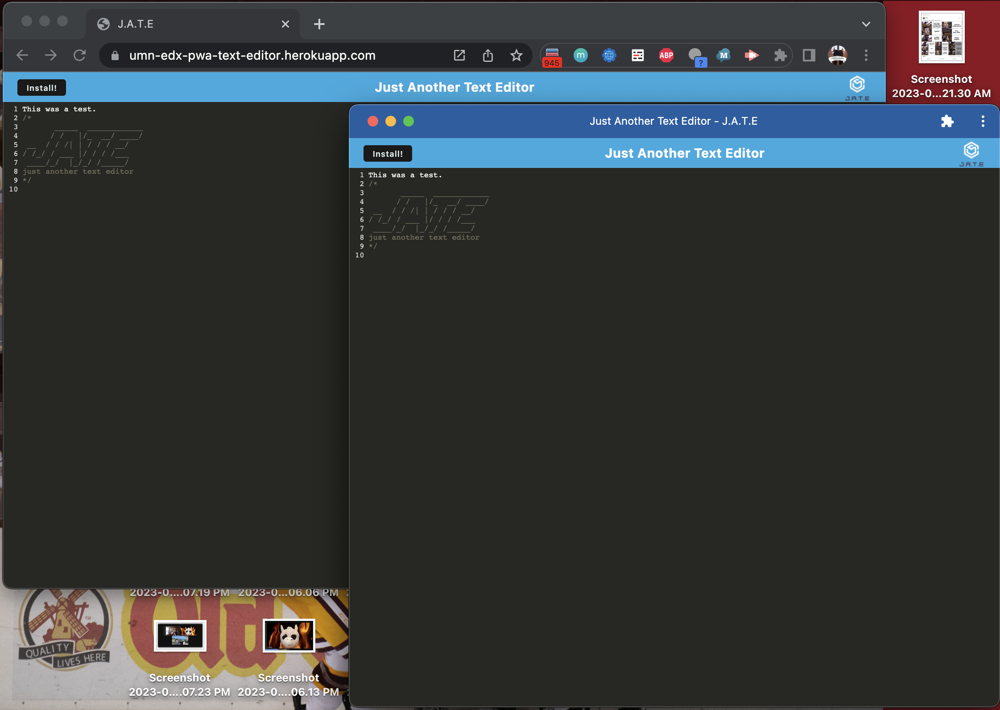

# umn-edx-progressive-web-applications-text-editor

## SUMMARY
This is a simple progressive web application (PWA) text editor that has a web interface and companion web application.  They are designed to be editable in parallel and should there be any interruption in Internet connectivity, the web interface is designed to re-sync with any offline text changes made on the companion app upon restoration of connectivity.

## SETUP AND EXECUTION
Should you desire to run the overall application (web and companion) locally, you can run `npm install` in the terminal from your local clone of this repository, then run `npm run start`.  Once done, you can use a browser to view the web application at http://localhost:3000.

From there you can make text edits and/or install the companion app.

Exiting the app in the terminal can be done with *Ctrl + C*.

## NOTES
This was meant to be a brief, high level study of PWA.  It was heavily suggested during instruction that PWAs have become rare due to increasingly reliable Internet connectivity as well as more convenient mobile applications, so most of the code was provided by the instructor save for sections involving the configuration of Webpack, installation of the companion, and database interaction.

Although a couple of fixes to instructor-provided code had to be made to get the overall application to function properly, this was, again, meant to be a brief study and rigorous testing was not performed, so some glitches may be present such as needing to reload the browser for changes to be reflected on the web interface.

I also never got the overall application to function properly in local dev mode even though attempts were made, which offered clues to an issue with the instructor-provided code.

## LIVE VIEW
You can view the live app on [Heroku](https://umn-edx-pwa-text-editor.herokuapp.com/).

